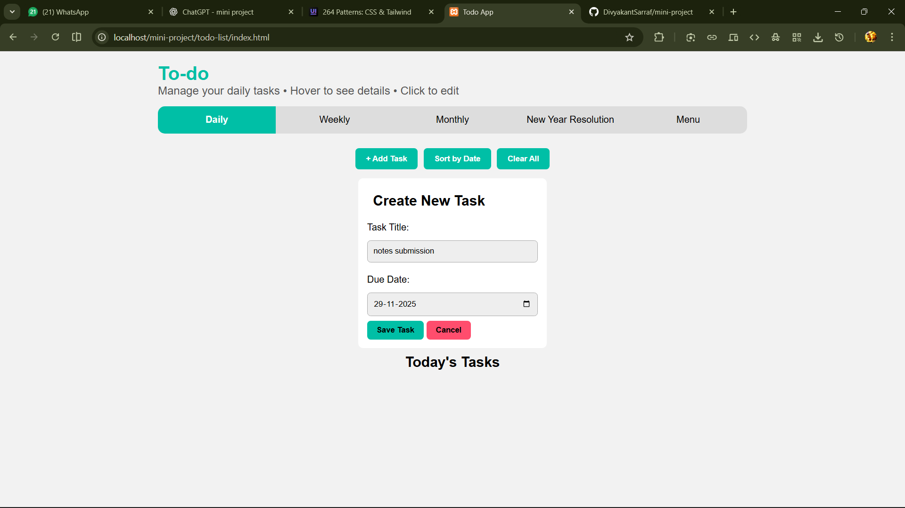

# mini-project
# To-Do App

A simple ToDo application with Daily, Weekly, Monthly, and Yearly task management, built with basic HTML, CSS, JavaScript, PHP, and LocalStorage.  
This project was made under the Mini Project of the Web Technology subject to test the knowledge gathered during the semester.

---

## 📝 About the Project

This To-Do application helps users stay organized with multiple time-based task views and a clean UI.  
It includes theme switching, login & registration, profile storage using sessions, and local task management.

The project was created to:
- Practice web development fundamentals
- Understand front-end design and layout
- Implement sessions and form validations
- Use LocalStorage for client-side data
- Learn PHP backend concepts
- Apply semester knowledge in a real mini-project
- Use AI (ChatGPT) to improve logic, UI, and documentation

---

## 🚀 Features

### ✔ Task Management
- Daily Tasks  
- Weekly Tasks  
- Monthly Tasks  
- Yearly Tasks  
- Edit, Delete, and Mark Completed  
- Hover to show details  
- Smooth responsive UI  

### ✔ User System
- Register (session-based)  
- Login  
- Logout  
- User Profile display in Menu  

### ✔ Menu Page Sections
- Profile Info  
- Theme Toggle (Light / Dark)  
- Tips Section  
- Shortcut Guide  
- Clear All Tasks (localStorage)  
- Navigation Cards  

### ✔ UI/UX
- Responsive design  
- Smooth hover effects  
- Clean navigation bar  
- Dark and light theme support  
- Footer on all pages  

---

## 🛠 Tech Stack

### Frontend
- HTML5  
- CSS3 (light.css + style.css themes)  
- JavaScript (DOM + LocalStorage)

### Backend
- PHP  
- Sessions  
- XAMPP / Apache Server

### AI Tools
- ChatGPT (for UI, logic, debugging, documentation)

---

## 📂 Project Structure
mini-project/
│
├── index.html
├── weekly.html
├── monthly.html
├── yearly.html
│
├── menu.php
├── register.php
├── login.php
├── validate_register.php
├── login_validate.php
├── logout.php
│
├── style.css
├── light.css
│
└── assets/

---

## 🖼️ Screenshots

---

## ⚙️ How to Run (XAMPP)

1. Install XAMPP  
2. Place project inside: C:\xampp\htdocs\mini-project\
3. Start Apache server  
4. Open: http://localhost/mini-project/menu.php

---

## 🔐 Login & Registration

- Register stores: Name, Email, DOB, Phone, Address, Password  
- Login validates Username, DOB, Email, Password  
- Successful login → stored in `$_SESSION`  
- Menu page displays user profile information  

---

## 🎯 Project Objective

This mini-project demonstrates the following Web Technology concepts:
- HTML Forms  
- CSS Layout  
- JavaScript DOM  
- LocalStorage  
- PHP Form Handling  
- Session Management  
- Validation  
- Theming  
- Navigation  
- Error Handling  

---

## 👨‍💻 Author

- **Name:** Divyakant  
- **GitHub Username:** *DivyakantSarraf*  

---

## 🤖 AI Credits

ChatGPT was used for:
- UI improvements  
- CSS generation  
- Debugging  
- Documentation  
- Logic enhancement  

---

## 📄 License
Open-source project — free to modify and share.

